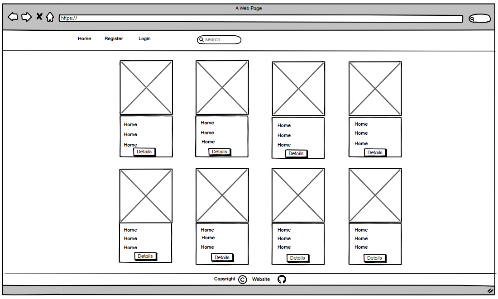
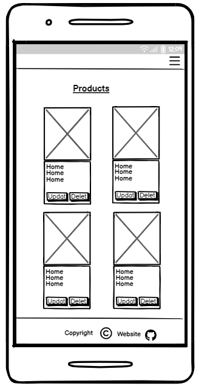
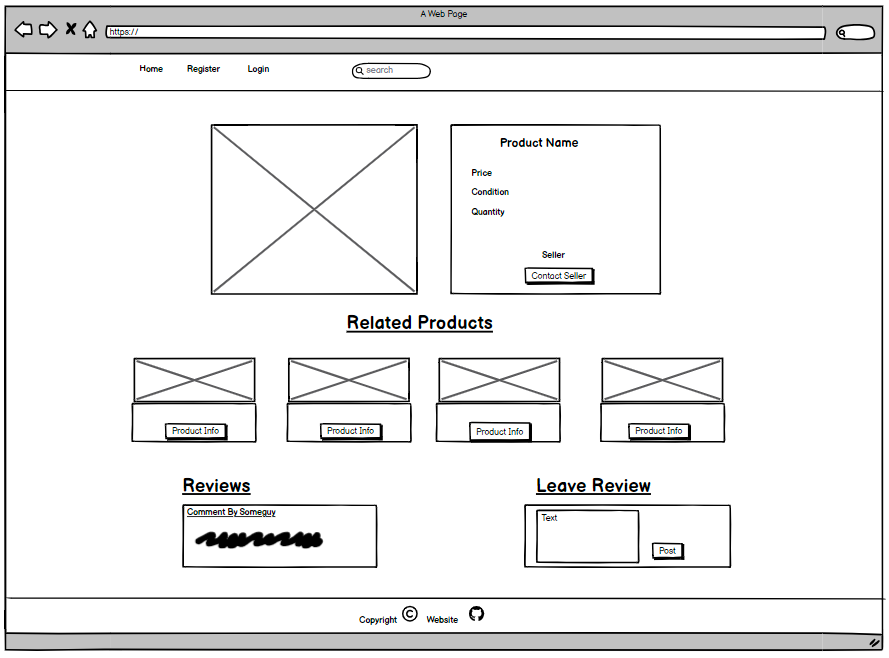
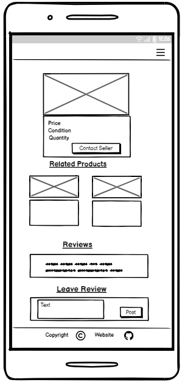
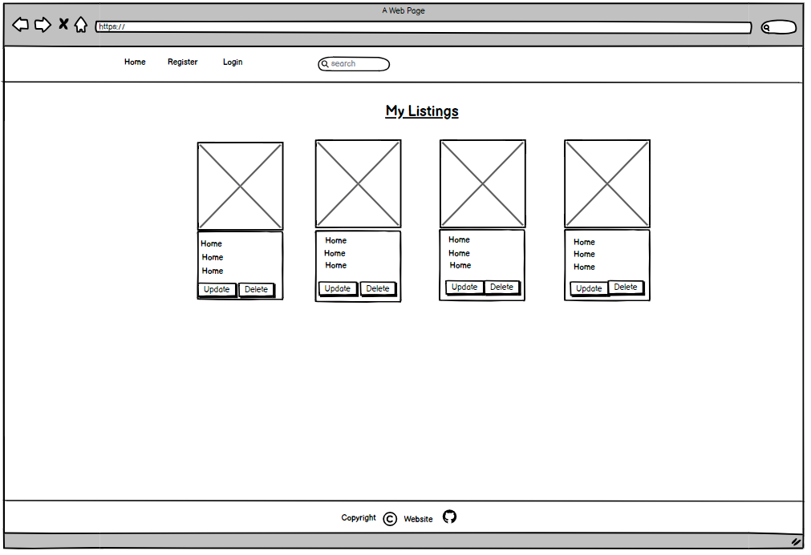
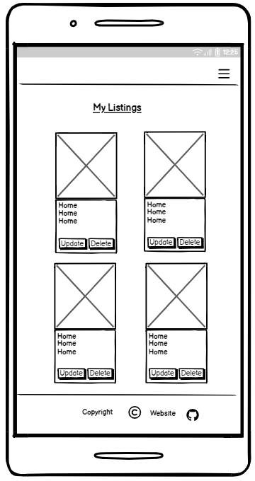
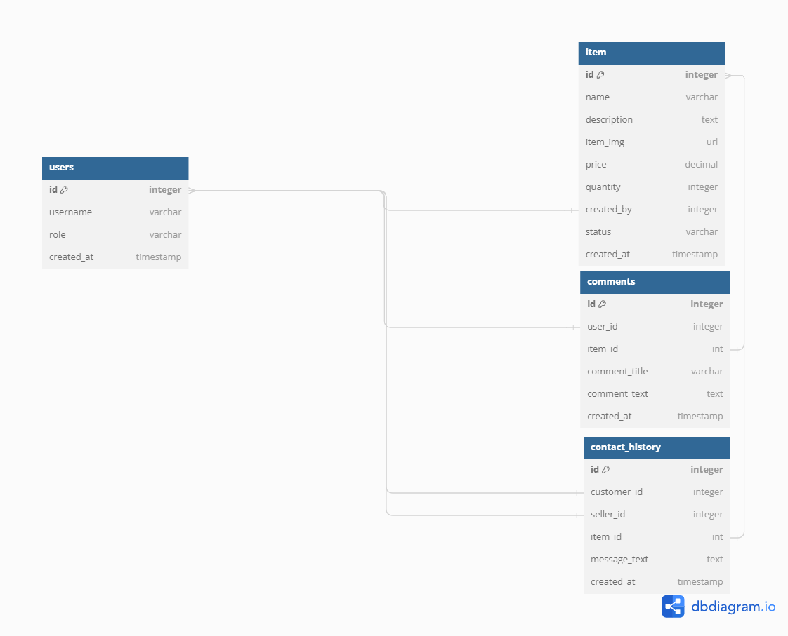

# Contents

1. [UX Design](#ux-design)
2. [User Stories](#user-stories)
3. [Features](#features)
4. [Testing](#testing)
5. [Deployment](#deployment)
6. [Credits/Technologies Used](#credits)
7. [Future Features](#future-features)

## UX Design

### All Products Page Wireframe Design

- Desktop

- Mobile

### Product Detail Page Wireframe Design

- Desktop

- Mobile

### My Listings/Profile Page Wireframe Design

- Desktop

- Mobile

### Inbox Page Wireframe Design

- Desktop

- Mobile

## User Stories

- 
  - 
- 
  - 
- 
  - 
- 
  - 
- 
  - 
- 
  - 

Database Diagram

## Features

- **Navigation Bar**

- **The Footer**

### Home Page

### About Page

### Gallery Page

### Contact Page

## Testing

### Manual Testing

### Lighthouse
The site was tested using Lighthouse with the following results:

### Responsive Testing

### Browser Compatibility
The site was tested on the following browsers:
- Chrome
- Firefox
- Edge
- Opera

### Validator Testing

- HTML

  - 

- CSS
  - 

## Bugs

## Deployment

- 

## Credits

### Content

### Media

## Future Features

There are various features and user stories that we were not able to implement due to time constraints, but would be added in future iterations of the website.

